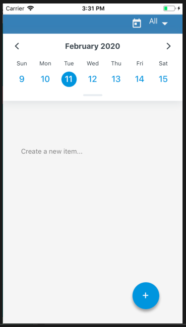

# BuJo2Go Mobile App

A bullet journaling mobile app to keep track of your different day to day bullet points on-the-go and on an interactive calendar.

Built with React Native and Expo and incorporates the [react-native-calendars package](https://github.com/wix/react-native-calendars) (v ^1.214.0) and the [react-native-keyboard-aware-scroll-view](https://github.com/APSL/react-native-keyboard-aware-scroll-view) (v ^0.9.1) package



## Prerequisites

Make sure you have the following:

- Node.js version >= 12.6.0
- npm version >= 6.11.3

To check your versions run `node -v` and `npm -v` in the command line.

## Try it out

You can run the app by performing these steps:

```
npm install expo-cli --global
git clone git@github.com:AidiRi/bujo2go-frontend.git
expo start

```

1. Install the Expo CLI,
2. Fork and clone this repository,
3. Start the app with Expo CLI

## Author

Aidiris Rivera

- Twitter: [@RiveraAidi](https://twitter.com/RiveraAidi)
- LinkedIn: [Aidiris Rivera](https://www.linkedin.com/in/aidiris-anette-rivera/)
- Dev.to: [AidiRi](https://dev.to/aidiri)
